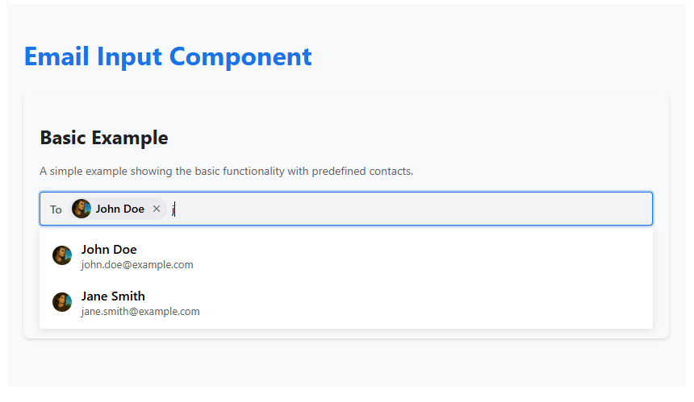

# contact Input Component

A react component for handling contact input with autocomplete and custom contact support.

## Installation

```bash
npm install contact-input-component
# or
yarn add contact-input-component
```

## Usage

```tsx
import React, { useState } from 'react';
import contactInput from 'contact-input-component';

const App = () => {
  const contacts = [
    { 
      id: '1', 
      name: 'John Doe', 
      description: 'john.doe@example.com',
      image: 'https://example.com/avatar.jpg'
    },
    // ... more contacts
  ];

  const [selectedContacts, setSelectedContacts] = useState([]);

  return (
    <contactInput
      label="To"
      contacts={contacts}
      selectedContacts={selectedContacts}
      onChange={setSelectedContacts}
      placeholder="Type to search contacts..."
      allowNewContacts={true}
    />
  );
};
```

## Props

| Prop | Type | Default | Description |
|------|------|---------|-------------|
| `label` | `string` | `'To'` | Label text for the input |
| `contacts` | `InputProps[]` | `[]` | Array of predefined contacts |
| `selectedContacts` | `InputProps[]` | `[]` | Array of currently selected contacts |
| `onChange` | `(contacts: InputProps[]) => void` | - | Callback function when contacts change |
| `onInputChange` | `(value: string) => void` | - | Callback function when input value changes |
| `allowNewContacts` | `boolean` | `true` | Whether to allow adding custom contacts |
| `placeholder` | `string` | - | Placeholder text for the input |

## Interface

```typescript
interface InputProps {
  id: string;
  name: string;
  description?: string;
  image?: string;
}

interface contactInputProps extends Omit<React.InputHTMLAttributes<HTMLInputElement>, 'onChange'> {
  label?: string;
  contacts?: InputProps[];
  selectedContacts?: InputProps[];
  onChange?: (contacts: InputProps[]) => void;
  onInputChange?: (value: string) => void;
  allowNewContacts?: boolean;
}
```

## Keyboard Navigation

- `↑` / `↓`: Navigate through suggestions
- `Enter`: Select highlighted suggestion or add custom contact
- `Escape`: Close suggestions dropdown
- `Backspace`: Remove last selected contact when input is empty

## Examples

### Basic Usage
```tsx
<contactInput
  label="To"
  contacts={contacts}
  selectedContacts={selectedContacts}
  onChange={setSelectedContacts}
/>
```

### Restricted Mode (No Custom Contacts)
```tsx
<contactInput
  label="To"
  contacts={contacts}
  selectedContacts={selectedContacts}
  onChange={setSelectedContacts}
  allowNewContacts={false}
/>
```

## Demo

<p align="center">
  
</p>

