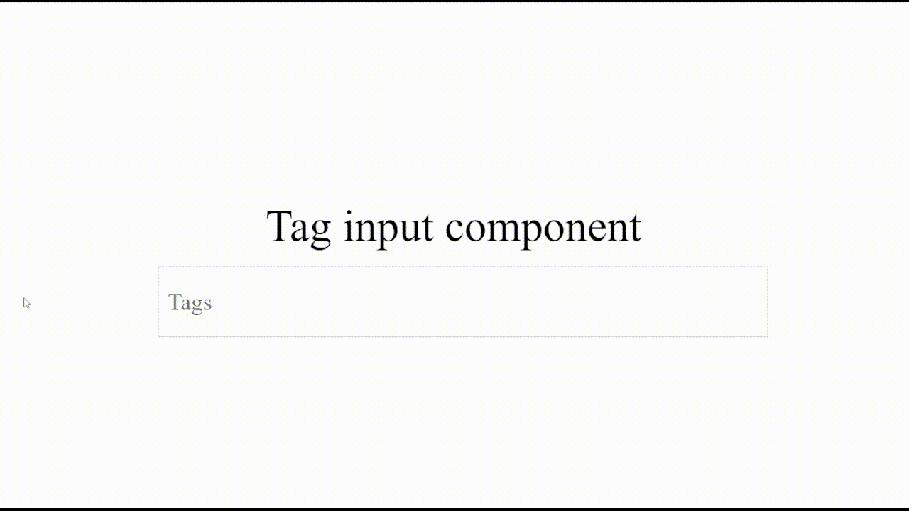

# Tag Input Component

## Demo


## Installation
```
npm install tag-input-component
```

## Usage Example

```javascript
import React, { useState } from "react";
import { TagInput } from "tag-input-component";

export default function Home() {
	const [tags, setTags] = useState<{id: string, text: string}[]>([])

	function addItem(e: React.KeyboardEvent<HTMLInputElement>) {
		if (e.key !== "Enter") return;
		e.preventDefault();
		const target = e.target as HTMLInputElement;
		const newTag = { id: Date.now().toString(), text: target.value };
		setTags((prev) => [...prev, newTag]);
		target.value = "";
	  }
	
	  function removeItem(id: string) {
		setTags((prev) => prev.filter((tag) => tag.id !== id));
	  }

	return (
		<main>
			<div style={{width: '400px'}}>
				<TagInput
					tags={tags}
					placeholder={'Tags'}
					addTag={addItem}
					removeTag={removeItem}
				/>
			</div>
		</main>
	);
}

```

